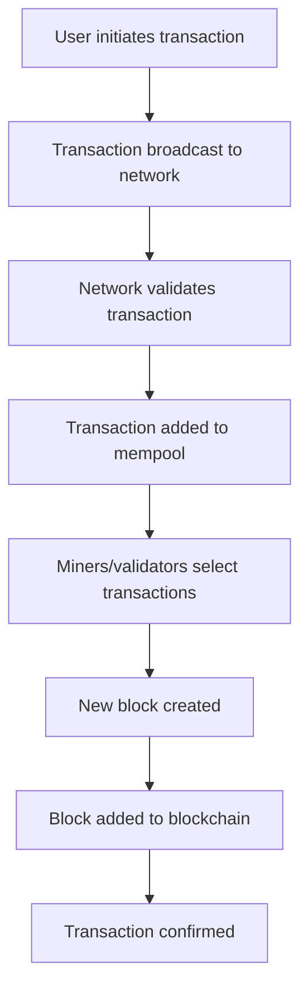

# Introduction to Cryptocurrency

Welcome to the fascinating world of cryptocurrency and blockchain technology! This comprehensive guide will introduce you to the fundamental concepts, terminology, and principles that power the digital asset ecosystem.

## What is Cryptocurrency?

Cryptocurrency is a digital or virtual form of currency that uses cryptographic techniques to secure transactions and control the creation of new units. Unlike traditional currencies issued by governments (fiat currencies), cryptocurrencies operate on decentralized networks based on blockchain technology.

### Key Characteristics

- **Decentralized**: No central authority controls the currency
- **Cryptographically Secure**: Uses advanced cryptography for security
- **Transparent**: All transactions are recorded on a public ledger
- **Immutable**: Once recorded, transactions cannot be easily altered
- **Pseudonymous**: Users are identified by addresses, not personal information

## Essential Terminology

### Blockchain
A distributed ledger technology that maintains a continuously growing list of records (blocks) linked and secured using cryptography.

### Wallet
A digital tool that allows you to store, send, and receive cryptocurrencies. Wallets can be:
- **Hot Wallets**: Connected to the internet (software wallets, exchange wallets)
- **Cold Wallets**: Offline storage (hardware wallets, paper wallets)

### Private Key
A secret cryptographic key that allows you to access and control your cryptocurrency. Never share your private key!

### Public Key
A cryptographic key that can be shared publicly and is used to receive cryptocurrency.

### Mining
The process of validating transactions and adding them to the blockchain, typically rewarded with new cryptocurrency tokens.

### Hash
A unique digital fingerprint created by a cryptographic function that represents data in a fixed-size string.

## Types of Cryptocurrencies

### 1. Bitcoin (BTC)
- The first and most well-known cryptocurrency
- Digital gold and store of value
- Limited supply of 21 million coins

### 2. Altcoins
Alternative cryptocurrencies to Bitcoin, including:
- **Ethereum (ETH)**: Smart contract platform
- **Litecoin (LTC)**: Faster version of Bitcoin
- **Cardano (ADA)**: Proof-of-stake blockchain
- **Solana (SOL)**: High-performance blockchain

### 3. Stablecoins
Cryptocurrencies pegged to stable assets like the US Dollar:
- **USDT (Tether)**
- **USDC (USD Coin)**
- **DAI (MakerDAO)**

### 4. Tokens
Digital assets built on existing blockchain platforms:
- **Utility Tokens**: Provide access to services
- **Security Tokens**: Represent ownership in assets
- **Governance Tokens**: Allow voting in protocol decisions

## How Cryptocurrency Works

### Transaction Process

1. **Initiation**: User creates a transaction using their wallet
2. **Broadcasting**: Transaction is broadcast to the network
3. **Validation**: Network nodes verify the transaction
4. **Inclusion**: Transaction is included in a block
5. **Confirmation**: Block is added to the blockchain
6. **Finalization**: Transaction is permanently recorded

## Benefits of Cryptocurrency

### Financial Inclusion
- Access to financial services without traditional banking
- Global reach regardless of location
- 24/7 availability

### Lower Fees
- Reduced transaction costs compared to traditional banking
- No intermediaries required
- Direct peer-to-peer transactions

### Speed
- Near-instantaneous transactions
- No waiting for bank processing
- Cross-border transfers without delays

### Transparency
- All transactions are publicly verifiable
- Open-source protocols
- Auditable transaction history

### Security
- Cryptographic protection
- Decentralized network security
- Immutable transaction records

## Risks and Considerations

!!! warning "Important Risks"
    - **Volatility**: Cryptocurrency prices can be extremely volatile
    - **Regulatory Uncertainty**: Changing regulations may affect value and usability
    - **Security Risks**: Loss of private keys means permanent loss of funds
    - **Scams**: Various fraudulent schemes target cryptocurrency users
    - **Technical Complexity**: Requires understanding of digital security

### Best Practices

1. **Never share your private keys**
2. **Use reputable wallets and exchanges**
3. **Start with small amounts**
4. **Research before investing**
5. **Keep software updated**
6. **Use two-factor authentication**
7. **Backup your wallet regularly**

## Common Use Cases

### Store of Value
Many people use cryptocurrency as a hedge against inflation and economic uncertainty.

### Remittances
Sending money across borders quickly and cheaply.

### Smart Contracts
Automated agreements that execute when conditions are met.

### Decentralized Finance (DeFi)
Financial services without traditional intermediaries.

### Non-Fungible Tokens (NFTs)
Unique digital assets representing ownership of digital or physical items.

## Getting Started Checklist

- [ ] Choose a reputable cryptocurrency exchange
- [ ] Set up a secure wallet
- [ ] Enable two-factor authentication
- [ ] Start with a small investment
- [ ] Learn about the specific cryptocurrencies you're interested in
- [ ] Understand the tax implications in your jurisdiction
- [ ] Never invest more than you can afford to lose

## Next Steps

Now that you understand the basics, you can:

1. **[Set up your environment](installation.md)** - Install necessary tools and wallets
2. **[Try the quick start guide](quick-start.md)** - Make your first transaction
3. **[Learn about blockchain fundamentals](../blockchain/what-is-blockchain.md)** - Deep dive into the technology
4. **[Explore specific cryptocurrencies](../crypto/bitcoin.md)** - Learn about Bitcoin, Ethereum, and others

---

*Remember: The cryptocurrency space is constantly evolving. Stay informed, stay secure, and never stop learning!*
